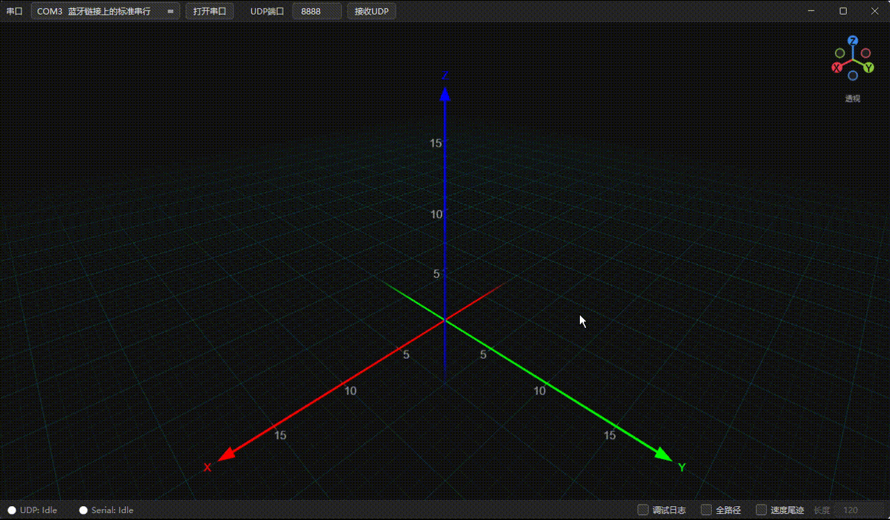
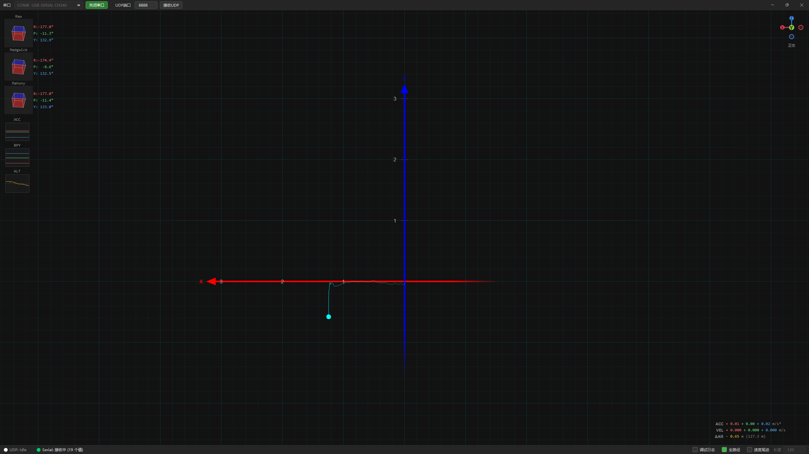
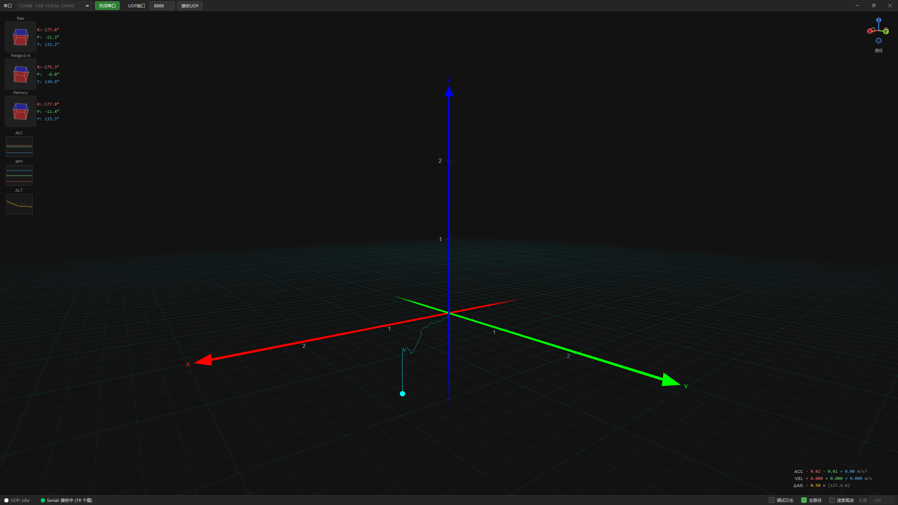

# TracerTracker

**原生 C++17 / Qt6 实时 3D 轨迹可视化工具。** 接收串口传感器数据或 UDP 信息，内置惯性导航解算管线，在 OpenGL 3D 场景中实时绘制运动轨迹。

> 本项目主要由 AI 辅助生成和编写。

---

## 项目优势

- **原生性能** — C++17 编译型程序，无解释器开销，Qt6 原生渲染，适合高频传感器数据流的实时处理。
- **OpenGL 3.3 Core 3D 渲染** — 自绘坐标轴、参考网格、多轨迹/多点渲染，4x MSAA 抗锯齿，透视/正交投影平滑切换。
- **完整 INS 管线** — 内置 Madgwick / Mahony AHRS 姿态融合、重力剥离、线性加速度积分、ZUPT 零速修正、垂直 Kalman 滤波 + 气压计融合，开箱即用。
- **双数据源** — 同时支持 UDP CSV 和串口（CSV / ATK-MS901M 二进制协议），前缀路由机制可区分多路数据流。
- **灵活的数据映射** — 通过 `config.json` 的 `points` 配置，可将任意传感器布局映射到加速度计、陀螺仪、磁力计、四元数或自定义 3D 点。
- **自定义无边框窗口** — Windows DWM 圆角集成，原生拖拽/缩放/最大化，深色主题全局统一。
- **丰富的调试 UI** — 双栏调试控制台、传感器时序图表、姿态叠加层、视角方位控件，所有面板可滑入/滑出。
- **可选依赖优雅降级** — Eigen3 和 Qt6 SerialPort 未安装时自动禁用对应功能，核心功能不受影响。

---

## 功能展示

### 透视 / 正交投影切换

透视与正交投影之间通过齐次坐标矩阵混合实现平滑过渡动画，而非简单跳变。


  

### 实时数据解析与轨迹渲染 ＆ 姿态叠加与传感器图表

传感器原始数据经 INS 管线实时解算，加速度积分后的位移轨迹即时绘制在 3D 场景中。
左侧边缘热区可滑出姿态面板和传感器时序图表，实时显示 Madgwick/Mahony 四元数、欧拉角、加速度、气压高度等数据。

 

---

## 项目结构

```
TracerTracker/
├── CMakeLists.txt                       # CMake 构建配置
├── config.json                          # 运行时配置
├── build.bat                            # 一键编译 + 部署 + 创建快捷方式
├── README.md
├── docs/
│   └── ins_algorithm.md                 # INS 管线算法原理技术文档
├── src/
│   ├── main.cpp                         # 入口：DPI、字体、OpenGL、主窗口
│   ├── config/
│   │   ├── ConfigLoader.h / .cpp        # 单例配置加载（自动搜索 config.json）
│   │   └── ConfigTypes.h                # 配置数据结构定义
│   ├── ins/
│   │   ├── Ahrs.h / .cpp               # AHRS 姿态解算（Madgwick / Mahony）
│   │   ├── Filters.h / .cpp            # 滤波器（Kalman、低通等）
│   │   ├── MathUtils.h / .cpp          # 四元数运算、坐标变换工具
│   │   └── PoseProcessor.h / .cpp      # 姿态处理器：重力剥离、积分、ZUPT、信号分发
│   ├── io/
│   │   ├── DataReceiver.h / .cpp       # UDP / 串口数据接收（后台线程）
│   │   └── Ms901mStreamParser.h / .cpp # ATK-MS901M 二进制协议帧解析
│   └── ui/
│       ├── MainWindow.h / .cpp          # 主窗口：组件组装、信号路由
│       ├── FramelessWindow.h / .cpp     # 自定义无边框窗口（DWM 集成）
│       ├── ToolBar.h / .cpp             # 工具栏（串口/UDP 控制）
│       ├── DebugConsole.h / .cpp        # 双栏调试控制台
│       ├── AttitudeWidget.h / .cpp      # 姿态叠加层
│       ├── SensorChartPanel.h / .cpp    # 传感器时序图表
│       ├── SensorInfoOverlay.h / .cpp   # 传感器数值叠加层
│       ├── ViewOrientationGizmo.h / .cpp # 视角方位控件
│       ├── Styles.h                     # 全局 QSS 深色主题样式
│       └── opengl/
│           ├── Viewer3D.h / .cpp        # OpenGL 3D 视图（相机、投影、交互）
│           ├── GridRenderer.h / .cpp    # 参考网格 + 坐标轴渲染
│           └── TrackRenderer.h / .cpp   # 轨迹点渲染
└── tests/
    ├── test_udp_sender.py               # UDP 螺旋数据测试发送
    └── test_udp_prefix.py               # UDP 前缀路由测试发送
```

---

## 数据流架构

```
串口 / UDP 原始数据
        │
        ▼
  DataReceiver              后台线程，解析 CSV 或 ATK-MS901M 二进制帧
        │
        │  dataReceived(source, prefix, QList<double>)
        ▼
  MainWindow::onDataReceived
        │
        ├──→ PoseProcessor::process     按 config points 提取传感器轴
        │         │                      Madgwick/Mahony 姿态估计
        │         │                      重力剥离 → 加速度积分 → 位移
        │         │                      ZUPT 零速修正 / Kalman + 气压
        │         │
        │         ├─ positionUpdated ──→ Viewer3D（轨迹点）
        │         ├─ velocityUpdated ──→ SensorInfoOverlay
        │         └─ filterQuaternionsUpdated ──→ AttitudeWidget
        │
        ├──→ Viewer3D::updatePoint      直接渲染 config 中 purpose=position 的点
        ├──→ SensorChartPanel            更新传感器时序图表
        └──→ SensorInfoOverlay           更新加速度/速度/高度数值
```

---

## 主要功能

### 实时数据接收

- 支持 **UDP** 和 **串口** 两种数据源，可同时启用。
- CSV 文本协议，可带前缀路由（如 `G:1.0,2.0,3.0`）。
- ATK-MS901M 二进制协议（自动帧同步 `0x55 0x55`、校验、多帧合并为 19 元素快照）。
- 串口自动扫描与热插拔检测。

### 内置 INS 引擎

- 6-DOF / 9-DOF **Madgwick 滤波** 与 **Mahony 滤波** 并行运行，或直接使用模块输出的四元数。
- 首帧倾斜（+磁力计）初始化，无需手动校准。
- 自动检测并剥离重力加速度，线性加速度二次积分输出位移轨迹。
- **ZUPT**（零速更新）：基于加速度/陀螺方差窗口检测静止状态，自动归零速度。
- **垂直 Kalman 滤波**：融合气压计高度（带低通滤波），抑制垂直漂移。
- 可配置 Madgwick beta、Mahony Kp/Ki、偏航补偿角等参数。

### 3D 渲染与交互

- **OpenGL 3.3 Core Profile**，4x MSAA 抗锯齿。
- 轨道相机：左键旋转、右键平移、滚轮缩放，长按 R 键分级复位。
- **透视 / 正交** 投影平滑切换，带混合过渡动画。
- 视角方位控件（Gizmo）：一键切换前/后/左/右/顶/底标准视角。
- 正交视图下网格自动在 XOY / XOZ / YOZ 平面切换，边界淡入淡出。
- 坐标轴标签根据观察角度自动淡出；没入参考平面背侧的元素降低明度以增强深度感。
- **全路径模式** 与 **速度尾迹模式**，尾迹长度可调。
- 多点独立渲染，颜色/大小可通过 config 配置。

### 界面与交互

- **自定义无边框窗口**：Win32 DWM 集成，非最大化时圆角边框，原生拖拽/缩放。
- 深色主题全局统一（`Styles.h`），微软雅黑中文字体。
- 双栏调试控制台：左侧原始/解析数据、右侧 INS 引擎日志，支持折叠、语法高亮、节流刷新。
- 传感器时序图表面板（加速度、欧拉角、气压、高度）。
- 姿态叠加层：实时显示四元数 / 欧拉角。
- 左侧边缘热区滑入/滑出面板。
- 底部状态栏：UDP/串口连接状态、数据活动指示（2 秒超时）。

---

## 依赖

| 依赖 | 版本 | 必需 | 说明 |
|------|------|------|------|
| CMake | >= 3.20 | 是 | 构建系统 |
| C++ 编译器 | C++17 | 是 | MinGW / MSVC |
| Qt6 Core, Gui, Widgets | 6.x | 是 | 基础框架 |
| Qt6 OpenGL, OpenGLWidgets | 6.x | 是 | 3D 渲染 |
| Qt6 Network | 6.x | 是 | UDP 数据接收 |
| Qt6 SerialPort | 6.x | 可选 | 串口通信，未安装则禁用串口功能 |
| Eigen3 | 3.x | 可选 | 矩阵运算，未安装则使用内置数学工具 |
| dwmapi | Windows | 自动 | DWM 窗口管理（Windows 系统库） |

---

## 编译与运行

### 一键编译

项目提供 `build.bat` 脚本，自动完成 CMake 配置、编译、Qt 依赖部署、配置文件复制，并在项目根目录创建启动快捷方式：

```bat
build.bat
```

编译成功后：
- 可执行文件位于 `build\TracerTracker.exe`
- Qt 运行时 DLL 已自动部署到 `build\` 目录
- `config.json` 已复制到 `build\` 目录
- 项目根目录已创建 **TracerTracker.lnk** 快捷方式，双击即可启动

### 手动编译

```bash
# 1. 配置（MinGW）
cmake -B build -G "MinGW Makefiles" -DCMAKE_BUILD_TYPE=Release

# 2. 编译
cmake --build build --config Release -j %NUMBER_OF_PROCESSORS%

# 3. 部署 Qt 依赖
windeployqt6 build\TracerTracker.exe

# 4. 复制配置文件
copy config.json build\config.json

# 5. 运行
build\TracerTracker.exe
```

> `ConfigLoader` 会在可执行文件所在目录查找 `config.json`，也会向上搜索最多 4 级父目录。

---

## 配置说明 (`config.json`)

首次运行且未找到配置文件时，程序自动生成默认配置。完整字段说明如下：

```jsonc
{
    // 重力加速度参考值 (m/s²)，用于剥离重力分量
    "gravity_reference": 9.80,

    "udp": {
        "enabled": true,          // 是否启用 UDP 接收
        "ip": "127.0.0.1",        // 监听地址
        "port": 8888              // 监听端口
    },

    "serial": {
        "enabled": true,
        "port": "COM5",           // 串口号
        "baudrate": 115200,
        "timeout": 1,
        "protocol": "atkms901m",  // "csv" 或 "atkms901m"
        "acc_fsr": 4,             // 加速度计满量程 (g)，仅 atkms901m 协议
        "gyro_fsr": 2000          // 陀螺仪满量程 (°/s)，仅 atkms901m 协议
    },

    "ins": {
        "kalman": {
            "enabled": true,              // 垂直 Kalman 滤波开关
            "process_noise_sigma": 0.5,
            "measurement_noise_R": 0.5
        },
        "zupt": {
            "enabled": true,              // ZUPT 零速修正开关
            "acc_variance_threshold": 0.5,
            "gyro_variance_threshold": 0.1,
            "window_size": 40
        },
        "baro_lpf_alpha": 0.1,            // 气压计低通滤波系数
        "madgwick": { "beta": 0.05 },     // Madgwick 滤波器增益
        "mahony": { "kp": 1.0, "ki": 0.0 }, // Mahony 比例/积分增益
        "filter_yaw_offset_deg": 90.0     // 偏航显示补偿角 (°)
    },

    "render_debug": {
        "enabled": false,         // 是否输出 3D 渲染调试信息
        "verbose_point_updates": false
    },

    // 数据点映射列表
    "points": [
        {
            "name": "ACC",
            "source": "serial",       // "serial" | "udp" | "any"
            "purpose": "accelerometer",
            "x": { "index": 0, "multiplier": 1.0 },
            "y": { "index": 1, "multiplier": 1.0 },
            "z": { "index": 2, "multiplier": 1.0 }
        },
        {
            "name": "QUAT",
            "source": "serial",
            "purpose": "quaternion",
            "w": { "index": 6, "multiplier": 1.0 },
            "x": { "index": 7, "multiplier": 1.0 },
            "y": { "index": 8, "multiplier": 1.0 },
            "z": { "index": 9, "multiplier": 1.0 }
        },
        {
            "name": "Point G",
            "source": "udp",
            "prefix": "G",            // 仅匹配带 "G:" 前缀的 UDP 数据
            "color": [0, 0, 255, 255], // RGBA 0-255
            "size": 15,
            "x": { "index": 0, "multiplier": 1.0 },
            "y": { "index": 1, "multiplier": -1.0 },
            "z": { "index": 2, "multiplier": -1.0 }
        }
    ]
}
```

### `points` 字段说明

| 字段 | 类型 | 说明 |
|------|------|------|
| `name` | string | 显示名称 |
| `source` | string | 数据来源：`"serial"` / `"udp"` / `"any"` |
| `purpose` | string | 特殊用途。`accelerometer` / `gyroscope` / `magnetic_field` / `quaternion` / `barometer` 会被 INS 引擎使用，不直接渲染为独立点。省略或设为 `position` 则作为 3D 可视化点。 |
| `prefix` | string | 仅匹配带有该前缀的数据包（如 `"G"` 匹配 `G:1,2,3`）。省略则匹配无前缀数据。 |
| `color` | [R,G,B,A] | 渲染颜色，0-255。默认红色。 |
| `size` | number | 点像素大小。默认 10。 |
| `x/y/z` | object | 各轴配置：`index`（数据数组下标）和 `multiplier`（缩放因子）。 |
| `w` | object | 仅 quaternion 用途，四元数 w 分量的 index/multiplier。 |
| `altitude` | object | 仅 barometer 用途，高度的 index/multiplier。 |
| `pressure` | object | 仅 barometer 用途，气压的 index/multiplier。 |

---

## 模块简介

| 模块 | 职责 |
|------|------|
| `MathUtils` | 四元数运算、坐标变换、初始姿态估算。无 Qt 依赖，可独立测试。 |
| `Ahrs` | Madgwick 6DOF/9DOF 与 Mahony AHRS 滤波器实现。 |
| `Filters` | Kalman 滤波器、低通滤波器等通用滤波算法。 |
| `PoseProcessor` | Qt 信号编排层：提取传感器数据、调用 AHRS 更新、积分位移、发射信号。 |
| `Ms901mStreamParser` | ATK-MS901M 二进制协议：帧同步（`0x55 0x55`）、校验、多帧合并为 19 元素快照。 |
| `DataReceiver` | 后台线程接收 UDP/串口数据，支持 CSV 文本和 ATK-MS901M 二进制协议。 |
| `Viewer3D` | OpenGL 3.3 Core 3D 视图，含轨道相机、投影切换、场景渲染管理。 |
| `GridRenderer` | 自适应参考网格、坐标轴、刻度标签渲染。 |
| `TrackRenderer` | 多轨迹点渲染，支持全路径与速度尾迹模式。 |
| `MainWindow` | 主窗口：组装所有组件、数据信号路由、调试控制台、状态栏。 |
| `FramelessWindow` | 自定义无边框窗口，Win32 DWM 圆角、原生拖拽/缩放。 |
| `ConfigLoader` | 单例模式加载/保存 `config.json`，自动搜索并提供默认值回退。 |

---

## 技术文档

INS 管线的完整算法原理（姿态初始化、Madgwick/Mahony 滤波器、重力剥离、位移积分、ZUPT、垂直 Kalman 滤波、偏航修正）详见：

**[docs/ins_algorithm.md](docs/ins_algorithm.md)**

---

## 测试工具

`tests/` 目录包含 Python 测试脚本，用于向应用发送模拟数据：

```bash
# 发送螺旋轨迹 UDP 数据到 127.0.0.1:8888
python tests/test_udp_sender.py

# 测试带前缀的 UDP 数据路由
python tests/test_udp_prefix.py
```
